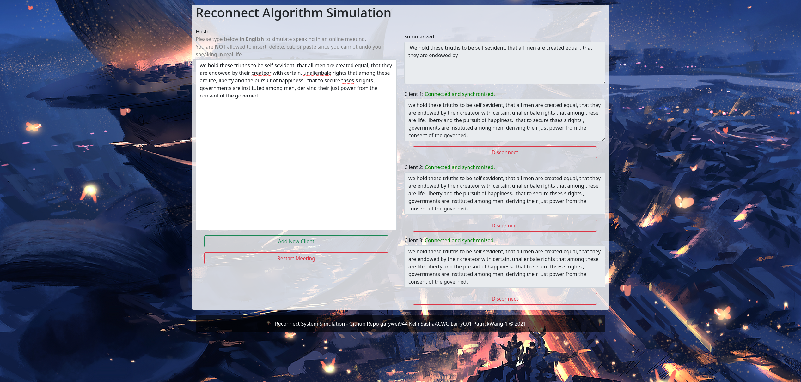

# Reconnect-Unicode21_Devil_Otter

## Project Name
Reconnect System (断线重联系统)



## Elevator Pitch
你有没有经历过这样的烦恼：上网课时，抬头低头间，发现教授讲的内容已经听不懂了；实习时和小组远程联络的时候，一走神，发现组长交待的任务没有听清楚；看大司马直播打英雄联盟时，去趟厕所回来后发现他的基地已经爆炸了......种种这些经历，是否让你特别烦恼，特别开胃，感觉特别下饭？不用着急，因为我们开发了断线重联系统，Reconnect System，可以在你掉线、走神回来后帮你快速弥补损失的内容，从而重新跟上进度。在网络会议、直播逐步成为生活中必需品的时代，断线重联系统会更好的帮助用户获取、收集、整合信息。

## About the Project
由于我们设计和制作的是一套系统，我们提交的作品是一款基于网页的模拟程序。出于时间原因，我们无法快速完成一款真正的会议软件，因为我们小组内每个成员都处于不同的时区，开发和测试将会非常困难。因此我们做了一个整合前端和后端、Host和Client的程序。

## 测试流程
1. 访问[unihack21-reconnect.herokuapp.com](https://unihack21-reconnect.herokuapp.com)以打开我们的程序。由于手机屏幕较小，不推荐使用手机浏览器，请使用电脑浏览器，从而能看清楚整体的效果。因为heroku服务器没有GPU，如果想测试自动summarize功能，请参考配置python环境部分，在本地或者GPU服务器上测试。
2. 请在 Host 文本框内输入英文内容来模拟网络会议、直播时的实时发言。由于是模拟实时发言，不能删除、插入、撤销、剪切、粘贴内容。
3. 请点击`Add New Client`按钮来模拟新的 Client 的加入。当新 Client 加入后，你可以点击每个 Client 对应的`Disconnect`或`Connect`按钮来模拟用户的掉线或重新连接。
4. 当用户掉线一段时间并重新连接时，或者有新的用户在会议进行一半时加入，他们将会进入 Catching Up 状态，即快速获取遗漏的内容，从而跟上其他听众的进度。
5. 如果在使用GPU服务器且配置好python环境，程序会每输入4个单词自动生成一次summarization。summarization显示在右上角的summarize文本框中。

## 启发及用途：
基于在已经期间我们对于网络直播和会议存在极大的需求，我们收到了这一显示问题的启发，并且制造出了这个系统用来解决“用户掉线后，重新连接还可以接收到遗漏的信息”这一问题。

## 实现思路
前端部分我们使用了ejs渲染引擎(html)、bootstrap(css)和jquery(javascripts)框架，后端实现我们采用了express(node.js)引擎，机器学习部分我们使用了[谷歌开发的自然语言处理中的BERT语言表示模型](https://arxiv.org/abs/1810.04805)和业界最流行的[huggingface](https://huggingface.co/) NLP框架。

## 实现时遇到的问题
在技术方面，我们遇到的问题主要是如何将自然语言处理部分和系统中其他部分整合起来以获得更加完美的表现。其中如何保证前段不重复的向服务器发送summarize请求是一个我们解决掉的问题。
在非技术方面，我们遇到的问题主要是如何在开发者们处于不同时区，且有各自不同的技术风格的时候，如何协调并达成一个令人满意的合作结果。

## 项目的亮点
在时间限制及地理位置上的限制下，我们尽全力做出了一个特点鲜明，功能丰富的系统，可以实现我们所提出的需求而且有很大的继续发展的空间。

## 我们学到了
利用相关编程语言开发一个具有给定可扩展功能的基于网站的系统，将学术论文中提到的BERT语言表示模型实现在这个具有应用前景的解决现实问题的项目中，以及如何协调不同时区，工作环境和开发习惯或者思维方式的四位软件开发者共同齐心协力完成一个目标的能力。

## 发展前景
基于这个有极大扩张性的系统，我们可以继续增加视频转文字的功能，让断开连接时参会者没有听到的主讲人的视频中内容变成概括后的文字被参会者接收到，形成一个更加现实的解决问题的“真正的会议软件”。

## Python environment installation
1. Install [`mamaba`](https://github.com/mamba-org/mamba), a C-implementation of `conda`.
2. Install conda virtual environment with `mamba`
```shell
cd app/scripts && mamba env create -f environment.yml
```

3. Activate the python environment and start the express back-end server
```shell
# cd to the project root directory
conda activate reconnect
cd app && npm start
```

4. Open [localhost:5000](http://localhost:5000/) in your favorite browser.

## Contributor
*Listed in lexicographical order.*
- [garywei944](https://github.com/garywei944)
- [KelinSashaACWG](https://github.com/KelinSashaACWG)
- [LarryC01](https://github.com/LarryC01)
- [PatrickWang-1](https://github.com/PatrickWang-1)

## License
This project is licenced under [MIT Licence](LICENSE)
